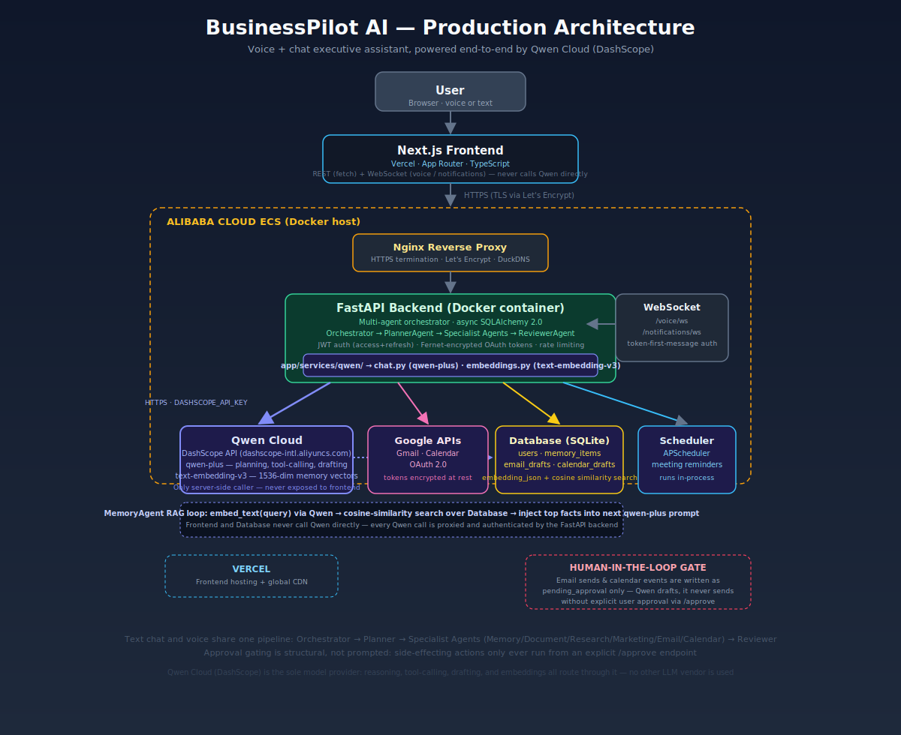
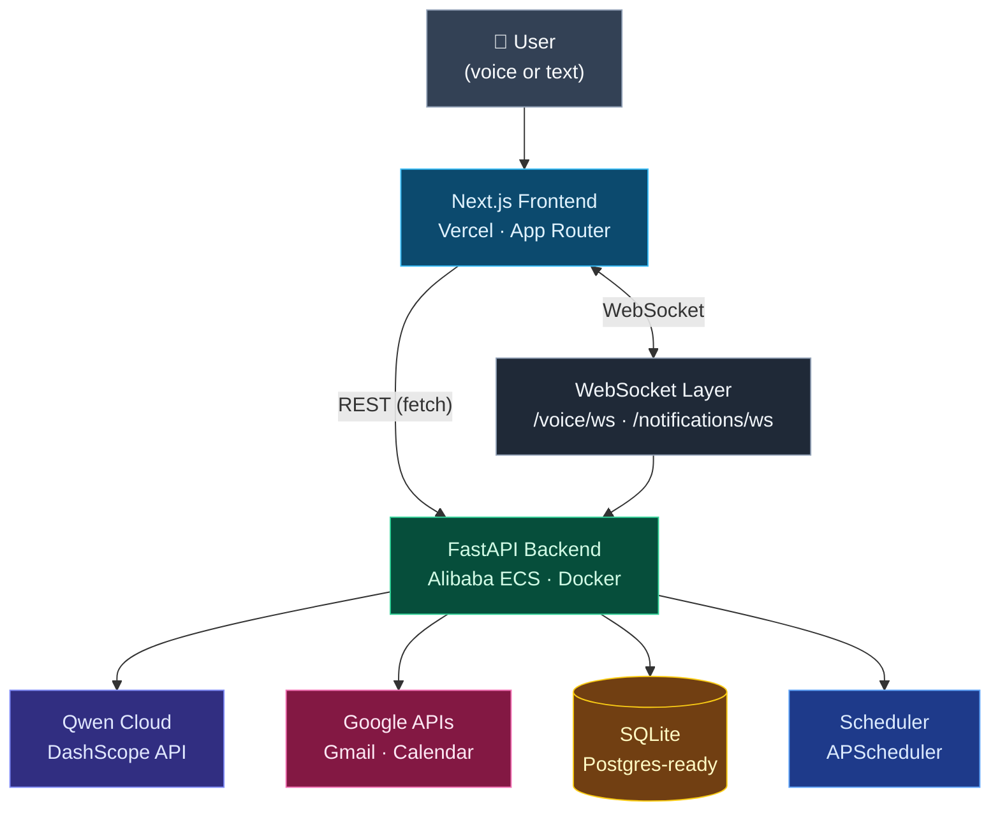
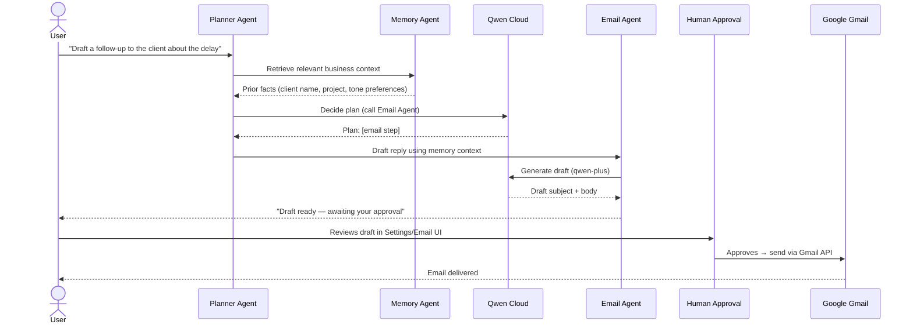

<div align="center">


# BusinessPilot AI

### The autonomous executive assistant that runs your business from a sentence.

**Talk to it or type to it — it plans, remembers, drafts, schedules, and creates real business
documents, powered end-to-end by Qwen Cloud, and never touches Gmail or your calendar
without your explicit approval.**

[](https://dashscope.aliyun.com/)
[](https://www.alibabacloud.com/)
[](https://fastapi.tiangolo.com/)
[](https://nextjs.org/)
[](https://www.docker.com/)
[](https://workspace.google.com/)
[](./LICENSE)

</div>

---

## 🏆 Qwen Hackathon Submission

| | |
|---|---|
| **Project Name** | BusinessPilot AI |
| **Primary Track** | Track 4 – Autopilot Agent |
| **Secondary Capabilities** | Track 3 – Agent Society · Track 1 – MemoryAgent |
| **Qwen Models Used** | `qwen-plus` (reasoning/planning), `text-embedding-v3` (memory) |
| **Deployment** | Alibaba Cloud ECS (Docker) |
| **Frontend** | Vercel |
| **Backend** | FastAPI + Docker + Nginx (HTTPS via Let's Encrypt) |
| **Demo Video** | [youtu.be/8BPogr7Eqdg](https://youtu.be/8BPogr7Eqdg) |

---

## 🏗️ Architecture



> Full request-flow and agent-pipeline notes: [docs/architecture.md](docs/architecture.md)

---

## Why BusinessPilot AI

Most small businesses can't afford a Chief of Staff. **BusinessPilot AI is an autonomous
executive assistant that automates business workflows from natural language, powered
entirely by Qwen Cloud.** You describe what you want in plain English — spoken or
typed — and it figures out the rest: which specialist to call, what to remember about
your business, what document to generate, and what draft to prepare for your sign-off.

It supports, out of the box:

- 🎙️ **Voice** — talk to it like a real assistant, hear it talk back
- 💬 **Chat** — the same brain, in text form
- 📧 **Gmail** — inbox summaries and drafted replies
- 📅 **Google Calendar** — meeting scheduling, conflict-aware
- 📄 **Document generation** — business plans, proposals, one-pagers as real `.docx`/`.pdf` files
- ✅ **Human approval** — nothing with a real-world side effect ships without your sign-off
- 🧠 **Memory** — semantic, long-term recall of facts about your business
- 🤝 **Multi-agent orchestration** — a planner, specialists, and a reviewer collaborating on every request

---

## Qwen Hackathon Track

### Primary Track — Track 4: Autopilot Agent

BusinessPilot AI **is** an autopilot for a small business's day-to-day operations. A
single natural-language request — "draft a follow-up to the client about the delayed
delivery" — is decomposed by a `PlannerAgent`, executed by the right specialist
(`EmailAgent`), quality-checked by a `ReviewerAgent`, and delivered as a ready-to-send
draft, with zero manual workflow-wiring by the user. The orchestrator (`app/agents/orchestrator.py`)
is a genuine autopilot loop: **plan → act → review → retry-if-needed → remember.**

### Secondary — Track 3: Agent Society

No single model call handles a request. Eight cooperating agents — `Planner`,
`Memory`, `Document`, `Research`, `Marketing`, `Email`, `Calendar`, and `Reviewer` —
each own a narrow responsibility and communicate through a shared `AgentContext`
(conversation history, business memory, user timezone). The Planner decides which
specialists a goal requires; specialists run in sequence; the Reviewer grades the
combined output and can send a single step back for a retry with corrective feedback.
This is a real multi-agent society, not a single prompt wearing different hats.

### Secondary — Track 1: MemoryAgent

The `MemoryAgent` isn't a keyword log. Every stored fact is embedded with
`text-embedding-v3`, deduplicated by cosine similarity, and retrieved for future turns
by a **similarity × importance × recency-decay** score — the same shape of scoring
real long-term-memory systems use. It runs before every orchestrator turn (to inject
relevant history) and after every turn (to extract and store new facts), and is shared
identically between the chat and voice pipelines.

---

## Features

<details open>
<summary><strong>🧠 AI Assistant</strong></summary>

- Natural-language requests routed to the right specialist automatically
- One shared pipeline for both chat and voice — no behavioral drift between the two
- Every turn logged as an auditable `AgentRun` (goal, plan, per-step results)
- Self-correcting: a Reviewer agent can force one retry of a failed step before replying
</details>

<details open>
<summary><strong>🎙️ Voice</strong></summary>

- Continuous speech-to-text via the browser's native Web Speech API (no server-side ASR)
- Spoken replies via native `SpeechSynthesis` — no audio round-trip to a TTS server
- Same orchestrator, same memory, same agents as text chat — voice is just another input mode
- Live partial-transcript captions while you're still talking
</details>

<details open>
<summary><strong>📧 Email Automation</strong></summary>

- Inbox summarization and prioritization on request
- Drafts new emails or replies in a professional tone from a one-line instruction
- **Never sends automatically** — every draft is a `pending_approval` row until you approve it
</details>

<details open>
<summary><strong>📅 Calendar Automation</strong></summary>

- Resolves natural-language scheduling ("next Friday at 10", "in three hours") to exact,
  timezone-aware datetimes
- Avoids proposing times that conflict with existing events
- Proposes — never creates — a meeting; creation only happens after explicit approval
</details>

<details open>
<summary><strong>🧠 Memory</strong></summary>

- Long-term, semantic (embedding-based) memory of facts about your business
- Automatic deduplication via cosine-similarity thresholding
- Recency-aware retrieval so stale facts fade in relevance over time
</details>

<details open>
<summary><strong>🤝 Multi-Agent Collaboration</strong></summary>

- Planner → Specialists → Reviewer pipeline, coordinated by a single orchestrator
- Specialists: Document, Research, Marketing, Email, Calendar
- Shared `AgentContext` carries memory, conversation history, and user timezone across every agent
</details>

<details open>
<summary><strong>🔔 Notifications</strong></summary>

- Real-time delivery over a `/notifications/ws` WebSocket
- Fired automatically when a document finishes generating or a draft needs approval
- Scheduled meeting reminders via a background APScheduler job
</details>

<details open>
<summary><strong>📄 Documents</strong></summary>

- Generates real downloadable files — `.docx` (`python-docx`) and `.pdf` (`fpdf2`)
- Business plans, proposals, one-pagers, and more, from a single conversational request
- Authenticated download links; files never exposed anonymously
</details>

---

## System Architecture



## Multi-Agent Architecture

Every request — typed or spoken — runs through the same orchestrator
(`app/agents/orchestrator.py`). It is not one model call; it's eight cooperating agents:

| Agent | Role |
|---|---|
| 🧭 **Planner Agent** | Reads the goal + memory + conversation history and decides which specialist agent(s) to call and in what order, or answers directly if no specialist is needed |
| 🧠 **Memory Agent** | Retrieves relevant long-term facts before the run (semantic search) and extracts/stores new facts after the run — shared by every other agent via `AgentContext` |
| 📄 **Document Agent** | Generates real `.docx`/`.pdf` business documents from a natural-language brief |
| 📧 **Email Agent** | Summarizes inbox messages or drafts new emails/replies — never sends directly |
| 📅 **Calendar Agent** | Resolves scheduling requests to exact timezone-aware datetimes and proposes meetings — never creates directly |
| 📈 **Marketing Agent** | Writes marketing copy, social posts, and ad text |
| 🔎 **Research Agent** | Produces market/competitor research briefs from Qwen's own knowledge, honestly flagging anything it isn't confident is current |
| ⚖️ **Reviewer Agent** | Grades the combined output against the user's original goal, writes the final user-facing reply, and can send exactly one step back for a corrective retry |

**How they collaborate:** the Memory Agent injects context → the Planner produces an
ordered list of steps, each assigned to one specialist → specialists run in sequence,
each seeing the same shared `AgentContext` (memory, conversation history, timezone) →
the Reviewer checks the combined results against the original goal and can force one
retry of a single failing step with specific corrective feedback → the Memory Agent
extracts and stores new facts from the finished turn. The **same pipeline** serves both
the text `/chat` endpoint and the `/voice` WebSocket — voice and chat are just two
front doors to one agent society.

## Business Workflow



## Human-in-the-loop

This is one of the strongest parts of BusinessPilot AI, and it is enforced
**structurally, not just by prompting the model to be careful.**

The `EmailAgent` and `CalendarAgent` tools do not have the ability to call the live
Gmail or Calendar API at all. They can only write a `status=pending_approval` row to
the database. The **only** code path in the entire backend that ever calls the real
Google APIs is a dedicated `/approve` endpoint (`/email/drafts/{id}/approve`,
`/calendar/events/{id}/approve`), triggered exclusively by explicit user action in the UI.

That means:

- ✅ **Emails** are always drafted, never sent, until you click approve
- ✅ **Calendar events** are always proposed, never created, until you click approve
- ✅ **Any external, side-effecting action** goes through the same gate

Even if the underlying model hallucinates, misreads an instruction, or is prompt-injected
by content in an email it's summarizing, there is no code path from "model output" to
"email sent" that skips the human. This is a hard architectural boundary, not a
best-effort guardrail.

## Qwen Cloud Usage

| Model | Purpose | Why Chosen | Example |
|---|---|---|---|
| **`qwen-plus`** | Reasoning, planning, agent execution | Strong instruction-following and JSON-mode reliability across every specialist agent, at a cost point that supports many agent calls per user turn (Planner + specialist + Reviewer is 3+ calls per request) | Planner decomposing "plan a product launch" into Research + Marketing + Document steps |
| **`text-embedding-v3`** | Memory — semantic retrieval | 1536-dimension embeddings available on the DashScope international workspace, used for cosine-similarity memory search, deduplication, and recency-weighted ranking | Recalling "the client's name is Acme Corp and they're on Net-30 terms" three conversations later |

**Why Qwen:** BusinessPilot AI is built entirely on Qwen Cloud (DashScope) as its sole
AI backbone — every agent's reasoning, every embedding, and the whole planner/reviewer
loop runs on it. `qwen-plus` gives reliable structured-JSON tool-calling behavior across
eight independent agents without per-agent prompt fragility, and `text-embedding-v3`
gives memory a genuine semantic-similarity foundation rather than keyword matching.

> **Note on voice:** server-side ASR/TTS (`paraformer`, `cosyvoice`) are not available on
> the DashScope international workspace used for this deployment, so speech I/O is
> handled entirely by the browser's native Web Speech API — a deliberate design choice
> that keeps voice latency low and removes an entire class of audio-pipeline failure
> modes, at zero extra Qwen spend.

## Alibaba Cloud Deployment

The backend runs as a single Docker container on an **Alibaba Cloud ECS** instance,
fronted by **Nginx** for TLS termination and reverse proxying:

```
Internet
   │  HTTPS (443)
   ▼
Nginx  ── TLS via Let's Encrypt (certbot), hostname via DuckDNS
   │  proxy_pass → 127.0.0.1:8000
   │  Upgrade/Connection headers forwarded for WebSocket routes
   ▼
Docker container (FastAPI + Uvicorn, port 8000)
   │
   ├─▶ Qwen Cloud (DashScope)      — outbound HTTPS
   ├─▶ Google APIs (Gmail/Calendar) — outbound HTTPS, OAuth2
   └─▶ SQLite (named Docker volume, Postgres-ready via DATABASE_URL)
```

- **Alibaba ECS** hosts the single backend container; the image is built and pushed to
  **Alibaba Container Registry (ACR)** via `scripts/push-to-acr.sh`, tagged with the git SHA
- **Docker** (via `docker-compose.prod.yml`) runs the API with a healthcheck against
  `/health` and `alembic upgrade head` executed automatically on every container start
- **Nginx** terminates TLS and reverse-proxies to the container's exposed port
- **HTTPS** is provided by **Let's Encrypt**, free and auto-renewing
- **DuckDNS** provides a stable hostname (`*.duckdns.org`) for a server without a
  purchased domain — pointed at the ECS instance's public IP
- **Reverse proxy** config explicitly forwards `Upgrade`/`Connection` headers — required
  for the `/voice/ws` and `/notifications/ws` WebSocket routes to work at all; a proxy
  configured for plain HTTP alone will silently 404 every WebSocket handshake while
  REST endpoints keep working fine
- **WebSockets** carry voice transcripts, spoken-reply triggers, and live notifications,
  authenticated by sending the JWT as the *first message* after connecting (never in the
  URL, so it never lands in access logs or browser history)

Full step-by-step deployment instructions are preserved below in
[Production Deployment](#production-deployment).

## Project Structure

```text
businessPilot/
├── backend/                         FastAPI application (deployed to Alibaba ECS)
│   ├── app/
│   │   ├── agents/                  The 8-agent society + orchestrator
│   │   │   ├── planner_agent.py       Decomposes a goal into specialist steps
│   │   │   ├── memory_agent.py        Semantic retrieve/store of business facts
│   │   │   ├── document_agent.py      Generates .docx/.pdf documents
│   │   │   ├── email_agent.py         Drafts/summarizes email (never sends)
│   │   │   ├── calendar_agent.py      Proposes meetings (never creates)
│   │   │   ├── marketing_agent.py     Marketing copy generation
│   │   │   ├── research_agent.py      Market/competitor research briefs
│   │   │   ├── reviewer_agent.py      Grades output, final reply, retry logic
│   │   │   └── orchestrator.py        Wires all agents into one pipeline
│   │   ├── api/v1/                  REST + WebSocket routes (auth, chat, voice,
│   │   │                            email, calendar, documents, memory, notifications)
│   │   ├── core/                    config, security (JWT), rate limiting, logging
│   │   ├── db/                      SQLAlchemy 2.0 async models + Alembic migrations
│   │   ├── repositories/            Thin async data-access layer, one per model
│   │   ├── schemas/                 Pydantic request/response models
│   │   ├── services/                Qwen client, Gmail/Calendar, memory, documents,
│   │   │                            OAuth, notifications, scheduler
│   │   └── websocket/               Connection manager for voice + notifications
│   ├── alembic/                     Migration versions
│   ├── tests/                       pytest-asyncio integration tests (Qwen/Google mocked)
│   └── Dockerfile
├── frontend/                         Next.js application (deployed to Vercel)
│   ├── app/                          App Router pages (chat, calendar, email, documents,
│   │                                 dashboard, settings, tasks, login, signup)
│   ├── components/                   AppShell, AuthProvider, VoiceButton, NotificationBell,
│   │                                 ProtectedRoute
│   ├── lib/                          api.ts (centralized fetch/WS client), auth.ts,
│   │                                 types.ts, useNotifications.ts
│   └── Dockerfile                    Alternate self-hosted deploy path (not used on Vercel)
├── docs/
│   ├── architecture.md               Detailed request-flow + agent-pipeline notes
│   └── architecture.svg               Architecture diagram (referenced above)
├── scripts/
│   └── push-to-acr.sh                Build + push the backend image to Alibaba ACR
├── docker-compose.yml                 Local dev (builds both services)
└── docker-compose.prod.yml            Production (backend image only, pulled from ACR)
```

## Technology Stack

<table>
<tr><td valign="top">

**Frontend**
- Next.js 16 (App Router)
- React 19
- TypeScript
- Tailwind CSS

</td><td valign="top">

**Backend**
- FastAPI (fully async)
- SQLAlchemy 2.0 (async)
- Alembic migrations
- Pydantic v2

</td><td valign="top">

**AI**
- Qwen Cloud (DashScope)
- `qwen-plus` (reasoning)
- `text-embedding-v3` (memory)

</td></tr>
<tr><td valign="top">

**Database**
- SQLite (dev/current prod)
- PostgreSQL-ready (`asyncpg`)
- Single `DATABASE_URL` swap

</td><td valign="top">

**Infrastructure**
- Docker
- Alibaba Cloud ECS + ACR
- Nginx reverse proxy
- APScheduler (background jobs)

</td><td valign="top">

**Authentication**
- JWT (access + rotating refresh)
- Fernet-encrypted OAuth tokens
- Google OAuth 2.0

</td></tr>
<tr><td valign="top">

**Deployment**
- Vercel (frontend)
- Alibaba ECS + Docker (backend)
- Let's Encrypt + DuckDNS (HTTPS)

</td><td valign="top">

**Voice**
- Web Speech API (`SpeechRecognition`)
- `SpeechSynthesis` (TTS)
- No server-side ASR/TTS

</td><td valign="top">

**Documents**
- `python-docx`
- `fpdf2`
- `markdown`

</td></tr>
</table>

---

## Installation

A voice and text first AI executive assistant for founders, freelancers, and small businesses —
powered entirely by **Qwen Cloud (DashScope)**. It plans, remembers, drafts, schedules,
and creates real business documents through natural conversation (typed or spoken),
while keeping a human in the loop for anything with a real-world side effect (sending
email, creating calendar events).

**Approval gating is structural, not just prompted.** The `send_email` and
`create_calendar_event` tools never call the real Gmail/Calendar API directly. Agents
can only create a `pending_approval` draft row; a separate `/approve` endpoint is the
only code path that ever touches the live Google API. This holds even if the model
misbehaves.

### Prerequisites

- Python 3.11+ (3.14 currently lacks prebuilt wheels for several pinned deps -- use 3.11)
- Node.js 20.9+
- A DashScope (Qwen Cloud) API key
- (Optional, for Email/Calendar features) a Google Cloud OAuth client

### Backend setup

```bash
cd backend
python3.11 -m venv .venv
source .venv/bin/activate
pip install -r requirements-dev.txt   # or requirements.txt for prod-only deps

cp .env.example .env
python -c "import secrets; print(secrets.token_urlsafe(48))"        # -> SECRET_KEY
python -c "from cryptography.fernet import Fernet; print(Fernet.generate_key().decode())"  # -> ENCRYPTION_KEY
# paste both into .env, plus your QWEN_API_KEY (already pre-filled if you provided one)

alembic upgrade head
uvicorn app.main:app --reload --port 8000
```

Swagger UI: http://localhost:8000/api/v1/docs

Run the test suite (Qwen/Google calls are mocked, no live API spend):

```bash
python -m pytest -q
```

#### Qwen Cloud (DashScope) configuration

`backend/.env`:

| Variable | Purpose |
|---|---|
| `QWEN_API_KEY` | Your DashScope API key |
| `DASHSCOPE_BASE_URL` | `https://dashscope-intl.aliyuncs.com/api/v1` (international) or `https://dashscope.aliyuncs.com/api/v1` (China) -- must match the region your key was issued in |
| `QWEN_CHAT_MODEL` | Default `qwen-plus` (qwen3-plus class) for all agent reasoning |
| `QWEN_EMBEDDING_MODEL` | Default `text-embedding-v3` for memory vectors |
| `DASHSCOPE_COMPAT_URL` | OpenAI-compatible endpoint used by the chat client |

> **Note on STT/TTS:** Server-side ASR and TTS (paraformer, cosyvoice) are not
> available on the DashScope international workspace. Voice I/O is handled entirely
> by the browser's Web Speech API — no server-side ASR/TTS configuration is needed.

#### Google OAuth (Gmail + Calendar) configuration

1. In [Google Cloud Console](https://console.cloud.google.com/), create a project and enable the **Gmail API** and **Google Calendar API**.
2. Create an **OAuth 2.0 Client ID** (type: Web application).
3. Add an authorized redirect URI matching `GOOGLE_REDIRECT_URI` in `.env` (default `http://localhost:8000/api/v1/integrations/google/callback`).
4. Copy the client ID/secret into `backend/.env` as `GOOGLE_CLIENT_ID` / `GOOGLE_CLIENT_SECRET`.
5. In the app, go to **Settings → Connect Google account**. Without this, the Email and Calendar agents will respond that the account isn't connected, but everything else works fine.

### Frontend setup

```bash
cd frontend
npm install
cp .env.local.example .env.local   # set NEXT_PUBLIC_API_BASE_URL to your backend
                                    # (http://localhost:8000 for local dev)
npm run dev
```

Open http://localhost:3000. Sign up, then try in Chat:

- "Write me a one-page business plan for my coffee shop."
- "Draft a follow-up email to a client about a delayed delivery."
- "Propose a meeting with my co-founder next week."

Type-check / lint / production build:

```bash
npx tsc --noEmit
npx eslint .
npm run build
```

### Running with Docker

```bash
docker compose up --build
```

This builds both services from their own `Dockerfile`s (`backend/Dockerfile` runs
Alembic migrations on boot; `frontend/Dockerfile` is a multi-stage Next.js
`output: "standalone"` build) and serves the backend on `:8000` and frontend on
`:3000`. Set `NEXT_PUBLIC_API_BASE_URL` in your shell before `docker compose up` if the
frontend needs to reach the backend at a non-default URL (it's a build-time value,
baked into the client bundle).

## Production Deployment

Only the **backend** is deployed as a Docker image. The frontend is a separate
client application and is **not** included in the backend build — deploy it
independently (Vercel, CDN, a second ECS instance, or another container).

### 1 — Prerequisites

- Docker installed locally and on the target server
- An **Alibaba Cloud** account with:
  - **ACR** (Container Registry) namespace created
  - An **ECS** instance (or ECI/ACK) to run the container
  - (Recommended) **ApsaraDB RDS for PostgreSQL** when you outgrow SQLite

### 2 — Build and push the backend image

The build context is `./backend/` only — the frontend directory is never included.

```bash
# Authenticate with ACR once
docker login registry.cn-<region>.aliyuncs.com \
  -u <ram-user> -p <ram-password>

# Build and push (uses git SHA as the tag for traceability)
export ACR_REGISTRY=registry.cn-<region>.aliyuncs.com
export ACR_NAMESPACE=<your-namespace>
export IMAGE_TAG=$(git rev-parse --short HEAD)

./scripts/push-to-acr.sh
```

The script builds from `./backend`, tags the image as
`${ACR_REGISTRY}/${ACR_NAMESPACE}/businesspilot-api:<tag>`, and pushes both the
versioned tag and `:latest`.

### 3 — Prepare the server environment

SSH into the ECS instance and create the production env file:

```bash
# Install Docker + Compose plugin if not already present
curl -fsSL https://get.docker.com | sh
apt-get install -y docker-compose-plugin   # Ubuntu/Debian

# Clone only the compose file, or copy it manually
scp docker-compose.prod.yml user@<ecs-ip>:/opt/businesspilot/
scp backend/.env.example     user@<ecs-ip>:/opt/businesspilot/.env.prod

# Edit .env.prod with real values (see section 4 below)
ssh user@<ecs-ip> "nano /opt/businesspilot/.env.prod"
```

The server needs only `docker-compose.prod.yml` and `.env.prod` — no source code.

### 4 — Required environment variables (`.env.prod`)

Start from `backend/.env.example`. The following must have real values in production:

| Variable | How to generate / where to get it |
|---|---|
| `ENVIRONMENT` | Set to `production` |
| `DEBUG` | Set to `false` |
| `SECRET_KEY` | `python -c "import secrets; print(secrets.token_urlsafe(48))"` |
| `ENCRYPTION_KEY` | `python -c "from cryptography.fernet import Fernet; print(Fernet.generate_key().decode())"` |
| `DATABASE_URL` | `postgresql+asyncpg://user:pass@<rds-host>:5432/businesspilot` |
| `QWEN_API_KEY` | Your DashScope key |
| `GOOGLE_CLIENT_ID` | From Google Cloud Console OAuth credentials |
| `GOOGLE_CLIENT_SECRET` | From Google Cloud Console OAuth credentials |
| `GOOGLE_REDIRECT_URI` | `https://<your-api-domain>/api/v1/integrations/google/callback` |
| `FRONTEND_ORIGIN` | `https://<your-frontend-domain>` (CORS allow-list) |

> **Never** commit `.env.prod` to source control. For secrets management at scale, use
> Alibaba Cloud **KMS** or store the values in the ACK/ECI environment configuration.

### 5 — Run the backend

```bash
ssh user@<ecs-ip>
cd /opt/businesspilot

# Pull the new image and restart
export ACR_IMAGE=registry.cn-<region>.aliyuncs.com/<namespace>/businesspilot-api:<tag>
docker compose -f docker-compose.prod.yml pull
docker compose -f docker-compose.prod.yml up -d

# Database migrations run automatically on every container start (alembic upgrade head).
# Verify the container is healthy:
docker compose -f docker-compose.prod.yml ps
curl http://localhost:8000/health
```

### 6 — Networking and HTTPS

Put the backend behind **Alibaba Cloud SLB** (Server Load Balancer) or an
**Nginx/Caddy** sidecar for HTTPS termination:

```nginx
server {
    listen 443 ssl;
    server_name api.yourdomain.com;

    location / {
        proxy_pass http://127.0.0.1:8000;
        proxy_http_version 1.1;
        proxy_set_header Upgrade $http_upgrade;   # required for WebSocket (/ws/*)
        proxy_set_header Connection "upgrade";
        proxy_set_header Host $host;
        proxy_set_header X-Real-IP $remote_addr;
    }
}
```

### 7 — Upgrading

```bash
# On your local machine
export IMAGE_TAG=$(git rev-parse --short HEAD)
./scripts/push-to-acr.sh

# On the server
export ACR_IMAGE=registry.cn-<region>.aliyuncs.com/<namespace>/businesspilot-api:${IMAGE_TAG}
docker compose -f docker-compose.prod.yml pull && \
docker compose -f docker-compose.prod.yml up -d
```

Database migrations run automatically when the new container starts.

### 8 — Scaling beyond a single instance

| Concern | Solution |
|---|---|
| Database | Switch `DATABASE_URL` to **ApsaraDB RDS for PostgreSQL** — no code changes needed |
| File storage | Swap `LocalStorageBackend` for an **OSS-backed** implementation in `app/services/storage_service.py` |
| Multiple API replicas | Deploy to **ACK** (Kubernetes); the SQLite → Postgres switch is required first |
| Secrets at scale | Store values in Alibaba Cloud **KMS** and inject via ACK Secret objects |

---

## Roadmap

- [ ] Open-source the full stack under a permissive license
- [ ] Multi-user organizations (teams sharing one business memory)
- [ ] CRM integrations (HubSpot, Pipedrive)
- [ ] Slack and WhatsApp as additional front doors to the same orchestrator
- [ ] Native mobile app (React Native / Expo)

## Why This Project Matters

Small businesses run on the founder's own time — every hour spent drafting an email,
chasing a calendar slot, or writing a one-page proposal is an hour not spent on the
actual business. Enterprise companies already have executive assistants, ops teams, and
software budgets to automate this; most small businesses have none of that. BusinessPilot
AI exists to give a solo founder or a five-person team the same leverage: an assistant
that never sleeps, remembers everything about the business, and gets faster every time
you talk to it — while keeping a human firmly in charge of anything that leaves the
building.

## License

MIT — see [LICENSE](./LICENSE).
